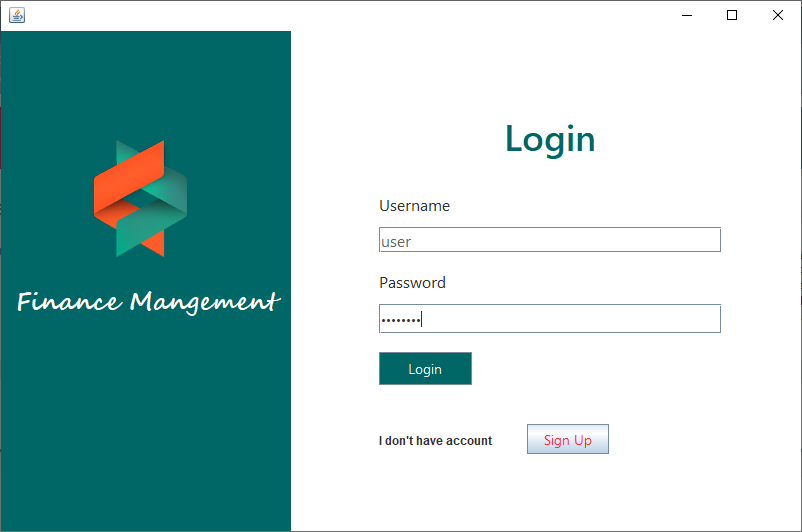
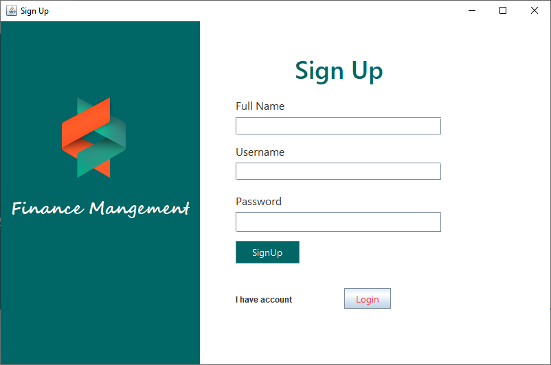
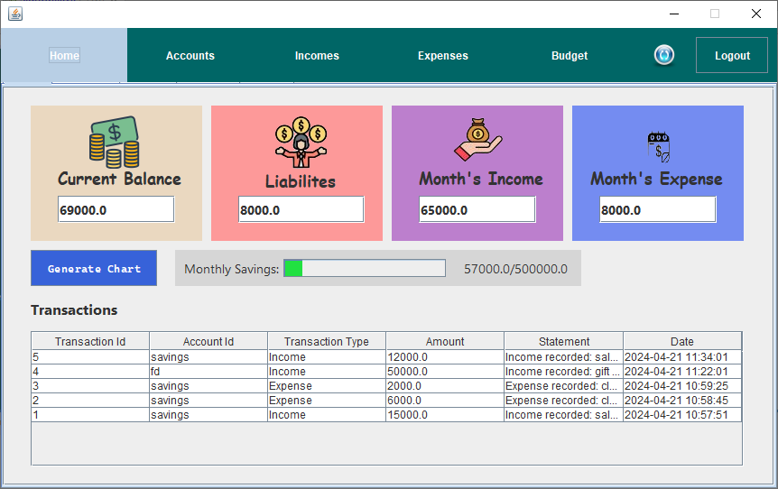
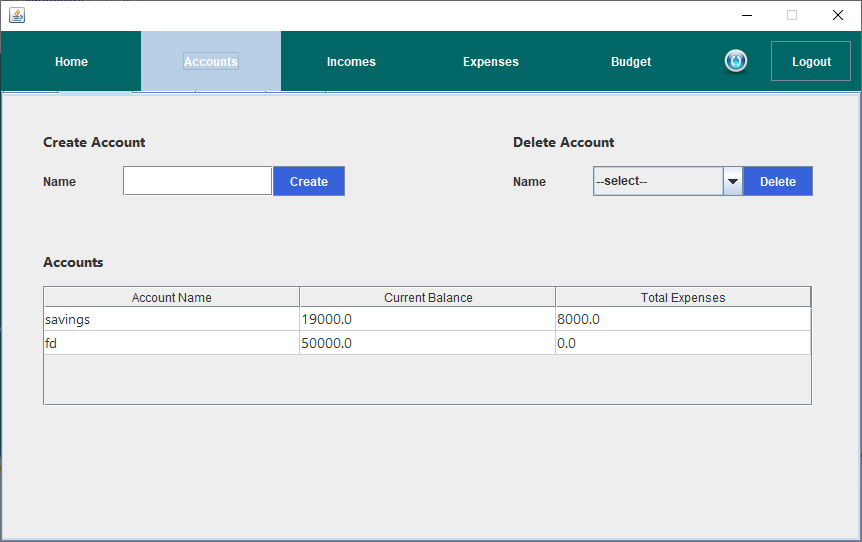
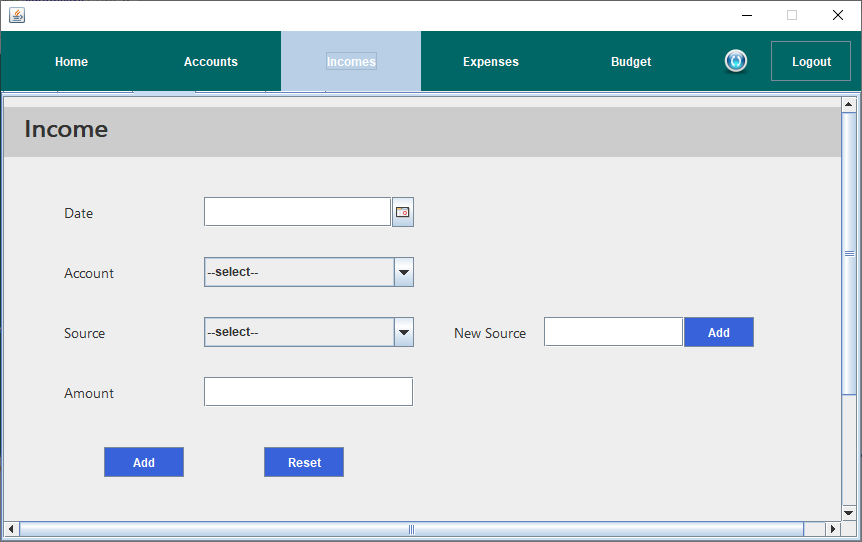
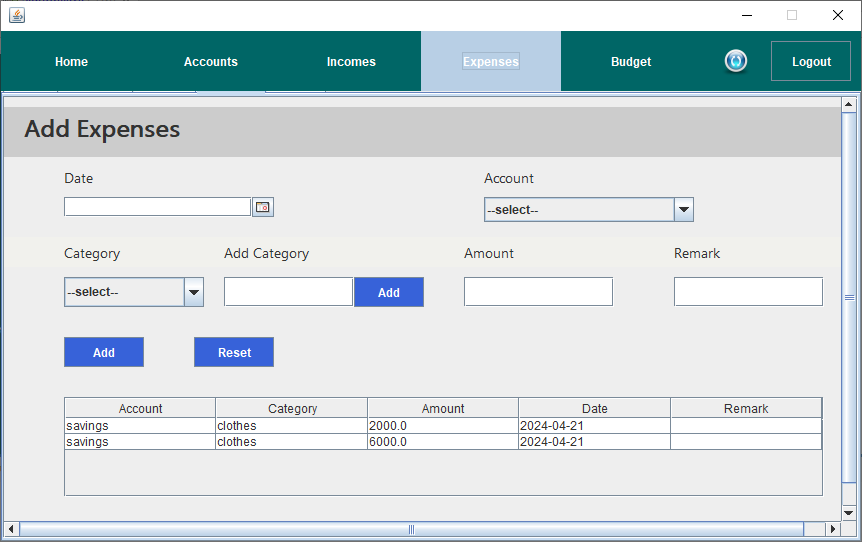
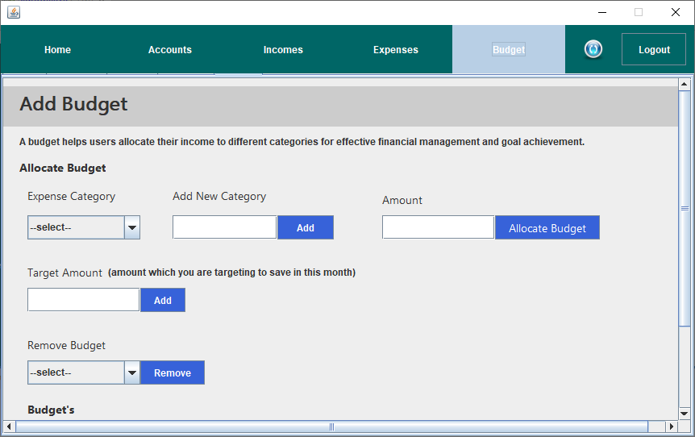

# Personal Finance Management System 💰

## Overview
The Personal Finance Management System is an application developed using Java Swing on Apache NetBeans IDE and MySQL for Database Management. This system enables users to monitor their financial habits, track previous transactions, and visualize monthly financial data using charts.

## Software Used
- **IDE:** Apache NetBeans
- **Database:** MySQL
- **Java UI Framework:** Java Swing
- **Chart Library:** XChart

## Features
1. **Account Management:** Users can create and manage multiple accounts to meet their financial needs.
2. **Summarized Display:** Provides users with a clear overview of their financial status, including current savings and spending habits.
3. **Income and Expense Tracking:** Dedicated tabs allow users to conveniently record their income and expenses, facilitating efficient management of finances.
4. **Interactive Charts:** Visualize monthly expenditure and savings through interactive charts, offering users insightful graphical representations of their financial data.
5. **Transaction History:** Easily access and review the latest transactions, enabling users to track their financial activity over time.
6. **Savings Target:** Set savings targets with a progress bar indicating the progress towards the goal for the current month, empowering users to stay focused on their financial objectives.

## Additional Libraries Used
- **JDBC Driver (MySQL Connector):** Connects Java applications to MySQL databases.
- **JCalendar:** Provides Date-related components for user-friendly date selection.
- **XChart:** Generates interactive charts for visualizing financial data.
- **AbsoluteLayout:** Facilitates precise positioning of UI components.

## Project Structure

```
📦src
┣ 📂Chart
┃ ┗ 📜IncomeExpenseChart.java
┣ 📂Database
┃ ┣ 📜DatabaseManager.java
┃ ┗ 📜UserSession.java
┣ 📂Home
┃ ┣ 📜HomePage.form
┃ ┗ 📜HomePage.java
┣ 📂Icon
┃ ┗ 📜icons.png...
┣ 📂Login
┃ ┣ 📜Login.form
┃ ┣ 📜Login.java
┃ ┣ 📜SignUp.form
┃ ┗ 📜SignUp.java
┗ 📂personalfinancemanagement
┗ 📜PersonalFinanceManagement.java
```

## Screenshots

### Login


### Signup


### Home


### Accounts


### Income


### Expense


### Budget


## Installation
1. Clone the repository.
2. Open the project in Apache NetBeans.
3. Set up the MySQL database according to the provided schema.
   - Navigate to the `database_setup` folder and follow the instructions in the `README.md` file to set up the database.
4. Run the project.

## Usage
1. Sign up for an account or log in if you already have one.
2. Add accounts and set up your financial details.
3. Record your income and expenses.
4. Monitor your financial status through the provided charts and summaries.

## Contributors
- [Onkar Mendhapurkar](https://github.com/onkar69483)
- [Mihir Hebalkar](https://github.com/mihirhebalkar)
- [Sachin Mhetre](https://github.com/SachinMhetre678)
- [Parimal Kulkarni](https://github.com/parimal1009)
